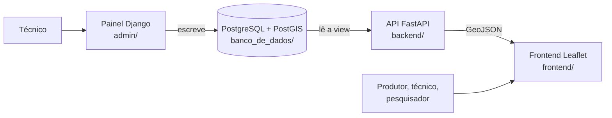

# 1. Arquitetura

## Visão geral

O SIGWeb separa **quem escreve** de **quem lê**. O técnico cadastra pelo painel Django, que grava no PostgreSQL/PostGIS. O mapa nunca grava: ele lê um GeoJSON servido pela API.

Regra central: **o SQL de `banco_de_dados/` é a fonte da verdade do esquema.** O Django nunca cria nem altera as tabelas do mapa (`managed = False`; ver [02](02-banco-de-dados.md)).

## Componentes

| Componente | Tecnologia | Pasta | Porta local | Papel |
|---|---|---|---|---|
| Banco | PostgreSQL + PostGIS | `banco_de_dados/` | 5433 (host) | Guarda os dados e entrega a view `vw_comunidades_dashboard` |
| Migrações | scripts SQL | `banco_de_dados/` | n/a | Serviço `sigweb-migrate`: aplica as `migracao_NN_*.sql` que faltam e sai |
| API | Python, FastAPI, psycopg2, Pydantic | `backend/` | 8000 (`API_PORT`) | Lê a view e devolve GeoJSON |
| Painel | Django | `admin/` | 8002 (`ADMIN_PORT`) | Cadastro de comunidades, coletas e parceiros |
| Frontend | HTML, CSS, JavaScript, Leaflet | `frontend/` | 5500 (servidor estático à parte) | Mapa, filtros, medição, exportação |

Não há etapa de build no frontend: são três arquivos estáticos (`index.html`, `app.js`, `style.css`) com bibliotecas por CDN em versões fixas (lista em [`sigweb.md`](sigweb.md), seção 1).

## Fluxo dos dados

1. O técnico entra no painel (`/admin/`) e cadastra a **comunidade** (nome, município, latitude, longitude) e uma **coleta** (produtores, rebanho, sistemas de criação, escrituração, observações).
2. O Django grava só `latitude` e `longitude`. O banco calcula sozinho a coluna `geom` (coluna gerada).
3. A view `vw_comunidades_dashboard` junta cada comunidade com a sua **coleta mais recente**.
4. O navegador chama `GET /api/comunidades/geojson`. A API consulta a view e monta um `FeatureCollection` no próprio PostgreSQL (`jsonb_build_object`, `ST_AsGeoJSON`).
5. O `app.js` desenha os pontos, soma os totais da visão geral no navegador e aplica filtros, busca, calor e exportações. Não há endpoint de resumo.

## API (`backend/main.py`)

| Método e rota | Função | Observações |
|---|---|---|
| `GET /api/comunidades/geojson` | GeoJSON de pontos, uma feição por comunidade | Usada pelo mapa. Comunidade sem coordenada fica de fora (`WHERE geom IS NOT NULL`). Sem dados, devolve `FeatureCollection` com `features: []` |
| `GET /` | Teste de saúde | Devolve a versão do PostGIS ou o erro de conexão |

A API **só lê**: não há rota de escrita. A antiga `POST /api/comunidades` (cadastro de comunidade e primeira coleta) foi **removida em 07/10/2026**, porque não tinha autenticação e o cadastro já é feito pelo painel Django, que grava direto no banco.

### Contrato do GeoJSON

Cada `Feature` tem `id` (o `comunidades.id`), `geometry` do tipo `Point` com `[longitude, latitude]` e estas `properties`:

`nome`, `municipio`, `informacoes_adicionais`, `total_produtores`, `qtd_caprinos`, `qtd_ovinos`, `criacao_extensiva`, `criacao_semi_extensiva`, `criacao_intensiva`, `escrituracao_sim`, `escrituracao_nao`, `observacoes`.

Comunidade sem nenhuma coleta aparece com esses campos numéricos `null`; o frontend os trata como `0`.

`municipio` é opcional no cadastro: quando nenhuma comunidade tem município preenchido, o filtro de município do mapa fica escondido; quando há valores, ele aparece com a lista montada a partir dos próprios dados.

### Variáveis de ambiente da API

| Variável | Padrão no código | Uso |
|---|---|---|
| `DB_HOST` | `localhost` | Servidor do banco |
| `DB_PORT` | `5432` | Porta do banco |
| `DB_NAME` | `sigweb_caprinu` | Nome do banco |
| `DB_USER` | `postgres` | Usuário |
| `DB_PASSWORD` | nenhum (**obrigatória**) | Senha. A API se recusa a subir sem ela |

No Docker, o `docker-compose.yml` define esses valores a partir do `.env`.

## Decisões de arquitetura

| Decisão | Motivo |
|---|---|
| Mapa só lê; painel só escreve | Evita duas portas de entrada de dados com regras diferentes |
| Esquema em SQL, Django `managed = False` | O banco é a fonte da verdade; o painel não pode divergir dele nem recriar tabelas do mapa |
| `geom` como coluna gerada | O ponto do mapa nunca diverge de latitude/longitude cadastradas |
| View com `DISTINCT ON` | Garante uma linha por comunidade (a coleta mais recente); sem ela, uma segunda coleta duplicaria o ponto |
| GeoJSON montado no PostgreSQL | A API não precisa fazer conta nem laço em Python |
| Totais somados no navegador | Evita endpoint novo; os totais valem exatamente para o conjunto filtrado |
| Frontend sem build | Qualquer pessoa edita e publica copiando arquivos |

## Segurança: pendências antes de publicar

| Item | Situação no código | Ação |
|---|---|---|
| CORS | `allow_origins=["*"]` | Restringir ao domínio do site (ou remover, se site e API ficarem no mesmo domínio) |
| Senha do banco | Sem padrão no `main.py` desde 07/10/2026: a API não sobe sem `DB_PASSWORD` | Definir senha forte no `.env`; conferir que `docker-compose.yml`, `.env.example` e `deploy/sigweb-api.service` não trazem `inovi` |
| Mensagens de erro | Corrigido em 07/10/2026: o cliente recebe mensagem genérica; o detalhe vai para o log da API | Ler o detalhe com `docker compose logs api` |
| Painel Django | Login por usuário e senha | HTTPS (`DJANGO_USAR_HTTPS=True`) e, se possível, camada extra de acesso |

## Implantação

- **Local:** `docker compose up -d --build` mais um servidor estático para o `frontend/`. Passo a passo em [05](05-reproducao.md).
- **Servidor próprio:** `deploy/nginx-sigweb.conf` serve `/` (frontend), `/api/` (API) e `/admin/` (painel). Mantém também o caminho antigo `/mapas/api/` por compatibilidade. A API pode rodar sem Docker pelo `deploy/sigweb-api.service`, nunca junto com o serviço `api` do compose.
- **Escolha do endereço da API no frontend:** em `file:`, `localhost` e `127.0.0.1` o `app.js` usa `http://127.0.0.1:8000`; em qualquer outro endereço usa `/api/comunidades/geojson` no próprio site.
