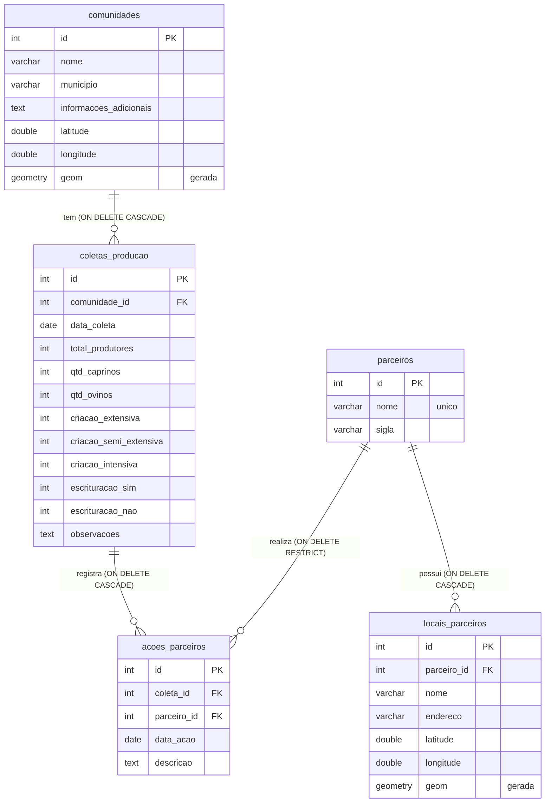

# 2. Banco de dados

PostgreSQL com a extensão PostGIS. O esquema completo para banco novo está em `banco_de_dados/criacao_tabelas.sql` (executado automaticamente pela imagem do PostGIS na primeira subida do volume). Bancos que já existem recebem as mesmas mudanças pelas `migracao_NN_*.sql`.

## Modelo entidade-relacionamento



**Ideia do modelo:** a **comunidade** guarda o que não muda (nome, lugar). A **coleta** guarda o que muda no tempo (rebanho, produtores, observações), então o histórico fica preservado: cada levantamento novo é uma nova linha, e o mapa mostra a mais recente. Os **parceiros** formam um catálogo único, para a mesma instituição não aparecer escrita de jeitos diferentes.

## Dicionário de dados

### `comunidades`: dados fixos e localização

| Coluna | Tipo | Regra | Descrição |
|---|---|---|---|
| `id` | SERIAL | PK | Identificador |
| `nome` | VARCHAR(150) | NOT NULL | Nome da comunidade ou associação |
| `municipio` | VARCHAR(100) | opcional | Alimenta o filtro de município. Escrever sempre do mesmo jeito (a lista do filtro vem dos próprios valores) |
| `informacoes_adicionais` | TEXT | opcional | Aparece em "Informações de cadastro" no painel do mapa |
| `latitude` | DOUBLE PRECISION | entre -90 e 90 | Graus decimais, negativo ao sul |
| `longitude` | DOUBLE PRECISION | entre -180 e 180 | Graus decimais, negativo a oeste |
| `geom` | GEOMETRY(Point, 4326) | **coluna gerada**, STORED | `ST_SetSRID(ST_MakePoint(longitude, latitude), 4326)`. Ninguém grava; é derivada |

No banco, `latitude` e `longitude` aceitam `NULL`; nesse caso `geom` fica nula e a comunidade não aparece no mapa. No painel Django os dois campos são obrigatórios.

### `coletas_producao`: dados variáveis e notas do técnico

| Coluna | Tipo | Padrão | Descrição |
|---|---|---|---|
| `id` | SERIAL | | PK |
| `comunidade_id` | INT | | FK para `comunidades(id)`, `ON DELETE CASCADE` |
| `data_coleta` | DATE | data atual | Data do levantamento. Define qual coleta é a "mais recente" |
| `total_produtores` | INT | 0 | Produtores da comunidade |
| `qtd_caprinos` | INT | 0 | Caprinos (cabeças) |
| `qtd_ovinos` | INT | 0 | Ovinos (cabeças) |
| `criacao_extensiva` | INT | 0 | Quantidade no sistema extensivo **[confirmar a unidade: produtores ou cabeças]** |
| `criacao_semi_extensiva` | INT | 0 | Idem, semi-extensivo |
| `criacao_intensiva` | INT | 0 | Idem, intensivo |
| `escrituracao_sim` | INT | 0 | Quantidade que faz escrituração zootécnica **[confirmar a unidade]** |
| `escrituracao_nao` | INT | 0 | Quantidade que não faz |
| `observacoes` | TEXT | | Nota técnica de campo; aparece como "Nota técnica de campo" no mapa |

O banco **não impõe** que a soma dos sistemas de criação, nem `escrituracao_sim + escrituracao_nao`, bata com `total_produtores`. Quem confere é o procedimento de qualidade (ver [04](04-metodologia.md)).

### `parceiros`: catálogo de instituições

| Coluna | Tipo | Regra | Descrição |
|---|---|---|---|
| `id` | SERIAL | PK | |
| `nome` | VARCHAR(150) | NOT NULL, UNIQUE | Nome da instituição |
| `sigla` | VARCHAR(30) | opcional | Rótulo curto do pino no mapa. Ex.: BNB |

### `locais_parceiros`: agências e escritórios (pinos)

| Coluna | Tipo | Regra | Descrição |
|---|---|---|---|
| `id` | SERIAL | PK | |
| `parceiro_id` | INT | NOT NULL, FK, `ON DELETE CASCADE` | Parceiro dono do local |
| `nome` | VARCHAR(150) | NOT NULL | Ex.: Agência Petrolina |
| `endereco` | VARCHAR(255) | opcional | |
| `latitude`, `longitude` | DOUBLE PRECISION | NOT NULL, mesmos limites | |
| `geom` | GEOMETRY(Point, 4326) | gerada, STORED | Mesma regra de `comunidades` |

### `acoes_parceiros`: o que o parceiro fez, junto da coleta

| Coluna | Tipo | Regra | Descrição |
|---|---|---|---|
| `id` | SERIAL | PK | |
| `coleta_id` | INT | NOT NULL, FK, `ON DELETE CASCADE` | Coleta em que a ação foi registrada |
| `parceiro_id` | INT | NOT NULL, FK, `ON DELETE RESTRICT` | Não dá para apagar um parceiro que tem ações: protege o histórico |
| `data_acao` | DATE | NOT NULL, data atual | |
| `descricao` | TEXT | NOT NULL | Ex.: curso de manejo sanitário, liberação de crédito |

> **Estado de uso:** as tabelas de parceiros são cadastradas no painel Django, mas a API atual (`backend/main.py`) **não as expõe**, então o mapa ainda não exibe parceiros. Ver [06](06-manutencao.md).

## A view `vw_comunidades_dashboard`

É o que a API lê. Junta cada comunidade com a coleta mais recente:

```sql
SELECT DISTINCT ON (c.id)
    c.id, c.nome, c.municipio, c.informacoes_adicionais, c.latitude, c.longitude,
    p.data_coleta, p.total_produtores, p.qtd_caprinos, p.qtd_ovinos,
    p.criacao_extensiva, p.criacao_semi_extensiva, p.criacao_intensiva,
    p.escrituracao_sim, p.escrituracao_nao, p.observacoes, c.geom
FROM comunidades c
LEFT JOIN coletas_producao p ON c.id = p.comunidade_id
ORDER BY c.id, p.data_coleta DESC NULLS LAST, p.id DESC;
```

Pontos importantes:

- **`DISTINCT ON (c.id)`** com `ORDER BY ... p.data_coleta DESC NULLS LAST, p.id DESC` escolhe uma linha por comunidade: a de data mais recente; em caso de mesma data, a de maior `id`.
- **`LEFT JOIN`**: comunidade sem coleta continua na view, com os campos de coleta nulos.
- As **ações de parceiros** não entram na view.

## Índices

| Índice | Tabela e coluna | Tipo | Finalidade |
|---|---|---|---|
| `idx_comunidades_geom` | `comunidades(geom)` | GiST | Consultas espaciais (por quadrantes) |
| `idx_coletas_comunidade` | `coletas_producao(comunidade_id, data_coleta DESC)` | B-tree | Achar a coleta mais recente de cada comunidade |
| `idx_locais_parceiros_geom` | `locais_parceiros(geom)` | GiST | Consultas espaciais |
| `idx_locais_parceiros_parceiro` | `locais_parceiros(parceiro_id)` | B-tree | Chave estrangeira |
| `idx_acoes_parceiros_coleta` | `acoes_parceiros(coleta_id)` | B-tree | Chave estrangeira |
| `idx_acoes_parceiros_parceiro` | `acoes_parceiros(parceiro_id)` | B-tree | Chave estrangeira |

A consulta atual da API lê **todas** as comunidades (sem filtro por área), então o índice GiST não é decisivo hoje; ele passa a valer quando houver consultas por região.

## Relação com o Django (`admin/sigweb/models.py`)

Os modelos `Comunidade`, `ColetaProducao`, `Parceiro`, `AcaoParceiro` e `LocalParceiro` espelham as tabelas, todos com `managed = False`. Isso significa:

- O Django **lê e escreve**, mas **não cria nem altera** essas tabelas. Mudanças de esquema são feitas em SQL (ver [06](06-manutencao.md)).
- A coluna `geom` **não aparece** nos modelos de propósito: é gerada pelo banco; o Django só grava latitude e longitude.
- `AcaoParceiro.parceiro` usa `on_delete=PROTECT`, espelhando o `ON DELETE RESTRICT` do banco.
- `Comunidade.ultima_coleta` devolve a coleta mais recente usando `ordering = ['-data_coleta', '-id']`, a mesma regra da view.
- As tabelas do próprio Django (usuários, sessões) ficam no mesmo banco, criadas pelo Django.

## Consultas úteis

Reproduzir os totais da visão geral:

```sql
SELECT count(*)              AS comunidades,
       sum(total_produtores) AS produtores,
       sum(qtd_caprinos)     AS caprinos,
       sum(qtd_ovinos)       AS ovinos
FROM vw_comunidades_dashboard;
```

Comunidades fora da área navegável do mapa (provável erro de digitação de coordenada). Os limites são os de `LIMITES` no `app.js`:

```sql
SELECT id, nome, latitude, longitude
FROM comunidades
WHERE latitude NOT BETWEEN -35 AND 6
   OR longitude NOT BETWEEN -75 AND -28;
```

Comunidades sem coleta (aparecem no mapa com valores zerados):

```sql
SELECT c.id, c.nome
FROM comunidades c
LEFT JOIN coletas_producao p ON p.comunidade_id = c.id
WHERE p.id IS NULL;
```

Histórico de uma comunidade:

```sql
SELECT data_coleta, total_produtores, qtd_caprinos, qtd_ovinos
FROM coletas_producao
WHERE comunidade_id = 1
ORDER BY data_coleta DESC, id DESC;
```

## Dados de exemplo

`banco_de_dados/carga_inicial.sql` contém dados **de exemplo**. Apague-os e cadastre os reais pelo painel antes de usar o sistema para valer.
